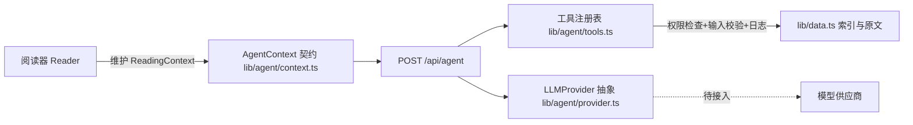

# 道可道 · 平台架构文档

> 本文档记录 2026-07 迭代（阶段 A–D 落地，E/F 接口预留）后的项目架构、修改说明与后续路线图。

## 一、当前架构

### 技术栈

| 层 | 选型 |
|---|---|
| 框架 | Next.js 16（App Router，Turbopack） |
| UI | React 19 + Tailwind CSS 4（CSS 变量设计令牌） |
| 语言 | TypeScript |
| 数据 | 静态 JSON（构建期由 `scripts/build-index.ts` 从 txt 生成） |
| 测试 | Node 内置 test runner（`npm test`，经 tsx 执行） |
| 部署 | Vercel |

### 模块边界

```text
app/                    页面与 API 路由（只做编排，不含业务逻辑）
  text/[id]/            阅读页（服务端组件：取数 + 解析 + SEO 元数据）
  library/              我的书房（客户端：本地数据）
  api/agent/            Agent API v1（工具调用 + chat 占位）
components/
  reader/               阅读器组件族（编排/渲染/目录/设置/划词/笔记 各自独立）
lib/
  content-schema.ts     内容数据模型（ContentBlock/ParsedBook/ImageAsset，接口契约单一来源）
  text-parser.ts        规则解析器 rule-v3（纯函数，可独立测试）
  parser-overrides.ts   人工校正层（/review 产出的 overrides 叠加到解析结果）
  zh-convert.ts         简繁转换（opencc-js），检索层查询变体扩展
  data.ts               索引与原文读取（服务端）
  fulltext-search.ts    全文检索（内存语料 + 简繁变体并集）
  user-data.ts          用户数据模型与本地存储（进度/收藏/笔记/设置/事件）
  use-local-data.ts     水合安全的本地数据 Hook
  ask-context.ts        阅读页 → 问道页的上下文交接（sessionStorage）
  agent/                Agent 架构（context 契约 / provider 解耦 / tools 注册表 / chat 运行时）
data/daozang-text/      原始 txt（不可变底稿）
data/parser-overrides.json  人工校正数据（/review 产出，随代码提交）
public/data/            index.json + content/*.json（构建产物）
tests/                  单元测试（解析器/检索/人工校正层）
```

### 内容三层模型（不可违反的边界）

1. **原始文本**：`public/data/content/*.json`，不可变底稿；
2. **结构化文本**：`parseText()` 在读取时按规则生成 ContentBlock（带行号溯源、置信度、解析器版本），低置信度块渲染为待审核样式；
3. **AI 增强内容**：`ai-explanation` 块类型与 Citation 引用结构已预留，必须显式标注，绝不与原文混排。

### Web as Agent 数据流



模型永不直接访问数据；一切经 `executeTool` 的权限检查、输入校验与日志。供应商通过 `getProvider()` 工厂切换，密钥仅存服务端环境变量。

## 二、本轮修改报告

### 新增

| 文件 | 说明 |
|---|---|
| `lib/content-schema.ts` | ContentBlock/ParsedBook/TocItem/ImageAsset 数据模型 |
| `lib/text-parser.ts` | 规则解析器：书名/卷/篇品/段落/诗偈/整理者按语识别 |
| `lib/user-data.ts` | 进度、收藏、笔记、阅读设置、事件模型（localStorage，模型可迁移服务端） |
| `lib/use-local-data.ts` | 水合安全的本地数据读取 Hook + 阅读设置共享 store |
| `lib/agent/context.ts` | AgentContext/ReadingContext/Citation 等契约 |
| `lib/agent/provider.ts` | LLMProvider 抽象 + NullProvider（供应商解耦） |
| `lib/agent/tools.ts` | 工具注册表：5 个已实现 + 14 个声明式占位 |
| `app/api/agent/route.ts` | Agent API v1（GET 工具清单 / POST tool·chat） |
| `components/reader/*`（6 个） | 阅读器组件族 |
| `components/ContinueReading.tsx` | 首页继续阅读条 |
| `app/library/page.tsx` | 我的书房（最近阅读/收藏/笔记） |
| `tests/text-parser.test.ts` | 解析器单测（8 例） |
| `.cursor/rules/*.mdc`（4 个） | 项目定位/设计令牌/组件架构/注释规范 |

### 修改

| 文件 | 原因 |
|---|---|
| `app/globals.css` | 设计令牌体系重建（宣纸白/墨黑/松绿/朱砂 + 字体/间距/动效令牌 + 三套阅读主题 + 结构化正文排版 + reduced-motion/焦点可见） |
| `app/text/[id]/page.tsx` | 客户端组件 → 服务端组件：正文 SSR（SEO）、结构化渲染、generateMetadata、相邻篇目服务端注入 |
| `app/page.tsx` | 接入继续阅读条；每日推荐抽为纯函数修复渲染纯度 |
| `components/Nav.tsx` | 新增「我的书房」入口，注释中文化 |
| `lib/data.ts` | 新增 `getContentById`（页面与 API 共用） |
| `app/api/entry/route.ts` | 消除 any 与路由内私有读文件逻辑，复用 lib/data |
| `app/api/adjacent/route.ts` | 修复只读 `data/index.json` 的生产环境隐患 |
| `app/not-found.tsx` | `<a>` → `<Link>` |
| `package.json` | 新增 `test`、`build-index` 脚本 |

### 兼容性

- `/api/entry`、`/api/adjacent` 契约不变（保留给外部消费）；
- 旧 `.text-content` 样式与全部旧 CSS 变量名保留；
- 无删除数据、无改写原文。

## 三、运行说明

```bash
npm install          # 安装依赖
npm run dev          # 开发
npm run build        # 构建
npm start            # 生产运行
npm run lint         # ESLint
npm test             # 解析器单测
npm run build-index  # 从 data/daozang-text/*.txt 重建索引与内容 JSON
```

环境变量（均为可选，仅服务端）：

```bash
# 配置后 AI 能力自动启用（划词「问道」按钮、chat 接口）；未配置时相关功能呈禁用态
DZ_LLM_BASE_URL=https://api.deepseek.com/v1   # 任意 OpenAI 兼容服务
DZ_LLM_API_KEY=sk-...
DZ_LLM_MODEL=deepseek-chat
```

严禁将密钥暴露到客户端；供应商实现见 `lib/agent/provider.ts`（OpenAICompatibleProvider）。

辅助脚本：`npx tsx scripts/parse-report.ts` 生成全库解析质量报告（`docs/parse-report.md`），解析器规则改动前后对比该报告评估回归。

人工审核流程（开发环境）：`npm run dev` 后访问 `/review`，按解析报告选书逐块确认/改判，
校正写入 `data/parser-overrides.json`，随代码提交后线上自动生效（线上无写入口；
私有部署如需开放审核页，设置 `DZ_ENABLE_REVIEW=1`）。

## 四、后续路线图

**已在第二轮完成**
- 解析器 rule-v2（卷终行/咒曰颂曰标签/署名行/单字延续词识别，低置信度率 9.89% → 8.88%）+ 全库质量报告脚本
- 全文搜索（服务端内存检索 + 搜索页双模式 + 关键词高亮，冷启动约 1.2s、热查询约 140ms）
- 阅读器书内搜索（基于 ContentBlock 定位 + 闪烁提示）
- OpenAI 兼容供应商 + `explain_selected_text` 工具 + 划词「问道」端到端联通（配置环境变量即启用）

**已在第三轮完成**
- 解析器 rule-v3（其N序号/咒名后缀/章节名白名单/科仪指示语，低置信度率 8.88% → 8.40%）
- 目录当前章高亮（IntersectionObserver 追踪，目录自动跟随滚动）
- `translate_to_modern_chinese` 工具 + 划词「译文」入口（与「问道」共用 ExplainPanel）
- 智能问道对话页（`/ask`）+ 对话运行时 `lib/agent/chat.ts`（系统提示词、书名号检索增强、
  引用来源返回、阅读上下文注入；AI 未配置时展示诚实的「尚未开通」状态）

**已在第四轮完成**
- 简繁转换层 `lib/zh-convert.ts`（opencc-js）：简体查询自动扩展繁体变体（含爲/為异体），
  全文搜索、书目搜索、对话检索全部命中繁体语料，高亮按实际命中词形
- 对话检索概念级升级：停用词剔除 + 标点切分提取概念候选词（如「什么是清静无为」→「清静无为」），
  每个概念取全文检索前 2 部典籍片段注入参考资料（上限 5 部，控制提示词长度）
- 阅读页「继续对话」入口：工具栏「问道此书」+ ExplainPanel「继续追问」，
  阅读上下文经 sessionStorage（`lib/ask-context.ts`）带入 /ask，页面显示可移除的上下文标签
- 低置信度块人工审核：`/review` 审核页（仅开发环境）逐块确认/改判 →
  `data/parser-overrides.json`（稳定键：原文行号+内容前缀，规则版本无关）→
  阅读页 `applyOverrides` 叠加（置信度记满、目录重建），校正数据随代码提交上线

**已在第五轮完成（AI 生成媒体资产）**
- 道乐页 `/music`：五行（金木水火土）主题背景器乐五首（MiniMax music-2.6，`scripts/gen-music.ps1`）、
  水墨主视觉与五行配图六张（LibTV / Seedream 5.0 Pro，`scripts/gen-images.ps1` + `scripts/compress-images.ts` 压缩）、
  《道德经》第一章 AI 朗读（MiniMax speech-2.8-hd）；共用单 `<audio>` 播放器，循环播放定位阅读背景乐
- 内容边界：AI 生成媒体页面显式标注来源，与典籍原文严格区分

**立即（下一轮）**
- 按解析报告推进人工审核：优先「低置信度占比最高」的符箓/表文类典籍
- 对话历史本地保存与书房集成
- 全文搜索升级为构建期倒排索引（消除冷启动成本）
- 道乐扩展：八卦/二十四节气主题曲目、阅读页内嵌背景乐开关

**下一阶段**
- 用户账号与数据同步（lib/user-data 模型已按可迁移设计）
- 概念检索升级：候选词提取从停用词规则升级为道教概念词表/分词器

**中期**
- 向量检索 + 语义搜索；人物/宗派/概念知识图谱；主题阅读与专题策展
- 图片资产接入（ImageAsset 模型已就绪，需来源审核流程）

**长期**
- TTS 有声典籍、章节导读视频生成、个性化推荐、PWA 与移动端 App

**风险**
- 数据：`其他` 类 59 部为文件名解析失败的边角案例，需人工归类；繁简混排未统一（已预留简繁模式设置方向）
- 技术：整本大部头（如《道法會元》）单页渲染，超长文本需评估虚拟滚动；Agent 接入后需防 Prompt Injection（工具层已有输入校验与权限门）
