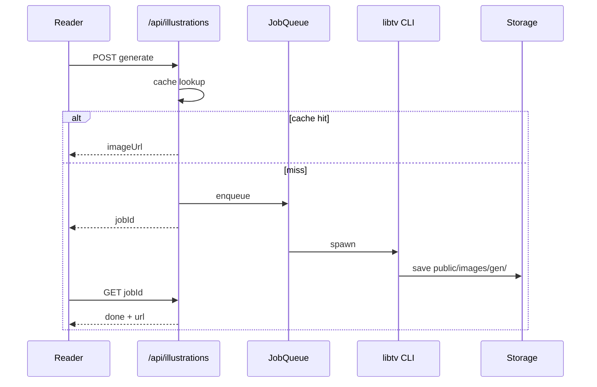

# PRD v2.0 实施路线图

> 本文档将产品需求 v2.0 映射到当前 **道可道** 代码库（Next.js 16 + 静态 JSON + localStorage），  
> 作为 Cursor 迭代开发的单一优先级来源。  
> 原则：**不推翻现有架构**，在 `lib/agent`、`components/reader` 上增量演进；数据库与队列仅在 P1 起引入。

---

## 0. 与 PRD 的技术栈对齐

| PRD 建议 | 本项目决策 | 理由 |
|----------|------------|------|
| FastAPI / NestJS 独立后端 | **暂保留 Next.js Route Handlers** | 已有 `/api/agent`、解析 SSR；P1 再拆 auth/queue 微服务或加 Postgres |
| PostgreSQL + Redis | **P1 引入**（Supabase/Neon + Upstash） | 当前无 DB；用户数据在 localStorage |
| Celery / BullMQ | **P0 用内存/文件队列；P0.5 用 BullMQ** | 插画生成可先 `app/api/illustrations` + 轮询 |
| DeepSeek 专用 env | **兼容现有 `DZ_LLM_*`**，新增别名 | 见 §3.1 |

愿景 **Web as Agent** 与 `.cursor/rules/daozang-vision.mdc` 一致，道者形象（P3）建立在 P0 埋点 + P1 账号之上。

---

## 1. 现状快照（2026-07）

### 已实现（可直接扩展）

| 能力 | 位置 | 完成度 |
|------|------|--------|
| 划词问道 / 译文 | `ExplainPanel` → `/api/agent` tool | 需配置 LLM |
| 智能问道页 | `app/ask/page.tsx` + `lib/agent/chat.ts` | RAG-lite + 引用 |
| 问道此书 / 继续追问 | `Reader` + `ask-context.ts` | 5 轮内 session |
| LLM 抽象 | `lib/agent/provider.ts` | OpenAI 兼容 |
| 工具注册表 | `lib/agent/tools.ts` | 8 实装 / 9+ 占位 |
| 科仪插图注入 | `lib/ritual-illustrations.ts` | 1 条样本 |
| 离线 libtv/mmx | `scripts/gen-*.ps1/ts` | 无在线 API |
| 本地进度/笔记/收藏 | `lib/user-data.ts` | 无账号同步 |
| 道乐页播放器 | `app/music/MusicPlayer.tsx` | **非全局** |
| 事件埋点壳 | `trackEvent()` | **仅 dev console** |

### 未实现（PRD 缺口）

- 流式响应、思考模式、模型分级（pro/flash）
- 配额 / 付费 / `ai_query_logs`
- 阅读页「生成插图」+ 异步任务 + 资产表
- 全篇 AI 解读按钮
- 任意账号体系（OAuth/JWT）
- 全局音乐条
- Postgres 表结构（users、notes 服务端化）
- 热门书目 / 推荐 / 个人资产
- 道者形象 Web Agent

---

## 2. 优先级与迭代包（Sprint）

### Sprint A — P0a：AI 问道加固（1–2 周）

**目标**：生产环境稳定可用，满足 PRD 3.1 核心路径。

| # | 任务 | 文件/接口 | 验收 |
|---|------|-----------|------|
| A1 | 环境变量规范 | `.env.example`：`DZ_LLM_*` + `DEEPSEEK_API_KEY` 别名 | Vercel 配好后 `/ask` 可用 |
| A2 | 双模型路由 | `provider.ts`：`DZ_LLM_MODEL_FAST` / `DZ_LLM_MODEL_PRO` | 划词用 flash，全篇用 pro |
| A3 | 思考模式（可选） | `ChatOptions.thinking` → body 扩展 | DeepSeek 文档对齐 |
| A4 | 流式 SSE | `POST /api/agent` `stream: true`；`ExplainPanel`/`ask` 消费 | 会员开关可后置，先 dev 流式 |
| A5 | 全篇解读 | `generate_chapter_summary` 工具 + Reader 底部按钮 | 返回概要 + 概念列表 |
| A6 | 追问上下文 | `ask/page.tsx` 持久最近 5 轮到 sessionStorage | 刷新可恢复 |
| A7 | 配额壳（匿名） | `lib/agent/quota.ts` + IP/指纹计数（Redis 或内存） | 免费 5 次/日，超限 429 |
| A8 | 查询日志（文件/DB 预备） | `lib/agent/query-log.ts` → 先写 JSONL，P1 迁表 | 字段对齐 PRD `ai_query_logs` |

**不改**：原文 JSON；AI 输出仍走 `ai-explanation` / ExplainPanel，不进 ContentBlock 正文。

---

### Sprint B — P0b：AI 插画在线化（1–2 周，与 A 并行）

**目标**：PRD 3.2 — 阅读页可请求生成，资产可复用。

| # | 任务 | 文件 | 验收 |
|---|------|------|------|
| B1 | 插图 API | `POST /api/illustrations/generate` | body: bookId, blockId, type: fu\|deity\|ritual |
| B2 | libtv 封装 | `lib/illustrations/libtv-runner.ts` | spawn `libtv` CLI，超时/重试 |
| B3 | 任务状态 | `GET /api/illustrations/[jobId]` | pending / done / failed |
| B4 | 资产存储 | `data/article-illustrations.json` → P1 迁 DB | 同 book+block+type 命中则返回缓存 |
| B5 | UI | `SelectionToolbar` 或 Reader 工具栏「生成插图」 | 轮询 + 插入 figure（标注 AI） |
| B6 | Prompt 模板 | `lib/illustrations/prompts.ts` | 符箓/神像/科仪三套 |
| B7 | 批量脚本保留 | `scripts/gen-ritual-illus.ts` | 离线灌库与在线 API 共用 prompt |

**队列**：MVP 用 `Map<jobId, Promise>` + 单 worker；流量大再上 BullMQ。

---

### Sprint C — P1a：埋点与匿名会话（1 周）

**目标**：PRD §4 — 为推荐与画像奠基，不依赖登录。

| # | 任务 | 说明 |
|---|------|------|
| C1 | `POST /api/events` | 接收 `trackEvent` 批量上报 |
| C2 | `lib/analytics.ts` | 统一 event schema：event, session_id, user_id?, book_id, platform, extra |
| C3 | 替换 `user-data.trackEvent` | 生产环境 POST，失败降级 localStorage 队列 |
| C4 | 补全事件 | `reading_progress`, `ai_ask_question`, `illustration_generate`, `music_*` |
| C5 | session_id | `localStorage` UUID，全站一致 |

---

### Sprint D — P1b：账号体系 MVP（2–3 周）

**目标**：PRD 3.3 最小闭环 — 邮箱 magic link 或密码 + JWT。

| # | 任务 | 说明 |
|---|------|------|
| D1 | 选型 | **Auth.js (NextAuth v5)** 或 Supabase Auth（与 Postgres 一体） |
| D2 | 表迁移 | `users`, `refresh_tokens`, `reading_progress`, `notes`, `highlights` |
| D3 | 迁移路径 | 登录后合并 localStorage → 服务端（一次性 import API） |
| D4 | Agent 权限 | `canReadUserData` / `canWriteUserData` 登录后 true |
| D5 | 实现工具 | `create_note`, `save_bookmark` 写服务端 |

OAuth（Google/微信）可 D 之后增量接入。

---

### Sprint E — P1c：全局音乐（3–5 天）

**目标**：PRD 3.4。

| # | 任务 | 文件 |
|---|------|------|
| E1 | 全局 Context | `components/music/GlobalMusicProvider.tsx` |
| E2 | 迷你控制条 | `components/music/MiniPlayer.tsx` → `app/layout.tsx` |
| E3 | 重构 MusicPlayer | 读写 global state，非页面内 `<audio>` |
| E4 | 偏好 | `reader-settings` 或独立 key：`musicEnabled` |
| E5 | 埋点 | `music_play`, `music_pause`, `music_track_change` |

---

### Sprint F+ — P2 / P3 / P4（ backlog ）

| 优先级 | 模块 | 依赖 |
|--------|------|------|
| P2 | 阅读计划、会话时长、阅读报告 | D |
| P2 | 热门书目（聚合 events）、规则推荐 | C |
| P2 | 功德/额度资产 | D + A7 |
| P3 | 器物科仪视频 | B + 外部视频 API |
| P3 | 道者形象 Lottie + 主动问候 | C + D + A |
| P4 | 同兴趣社交 | 全平台 DAU + 画像 |

---

## 3. 关键设计细节

### 3.1 DeepSeek 配置映射

```bash
# 推荐 .env（服务端）
DZ_LLM_BASE_URL=https://api.deepseek.com/v1
DZ_LLM_API_KEY=sk-...          # 或与 DEEPSEEK_API_KEY 二选一
DZ_LLM_MODEL=deepseek-chat     # PRD: deepseek-v4-pro 待官方 slug 更新后替换
DZ_LLM_MODEL_FAST=deepseek-chat  # PRD: v4-flash
```

`getProvider()` 扩展：

```typescript
getProvider(tier?: 'fast' | 'pro'): LLMProvider
```

思考模式：仅在 `tier === 'pro'` 且 env `DZ_LLM_THINKING=true` 时注入 `thinking` / `reasoning_effort`（以 DeepSeek 当前 API 为准）。

### 3.2 数据表草案（P1 迁移用）

```sql
-- users, refresh_tokens（标准 auth）

CREATE TABLE ai_query_logs (
  id UUID PRIMARY KEY,
  user_id UUID REFERENCES users(id),
  session_id TEXT,
  book_id TEXT,
  tool TEXT,
  model TEXT,
  prompt_tokens INT,
  completion_tokens INT,
  latency_ms INT,
  question_summary TEXT,
  created_at TIMESTAMPTZ DEFAULT now()
);

CREATE TABLE article_illustrations (
  id UUID PRIMARY KEY,
  book_id TEXT NOT NULL,
  block_id TEXT NOT NULL,
  type TEXT NOT NULL, -- fu | deity | ritual
  image_url TEXT NOT NULL,
  prompt_hash TEXT,
  status TEXT DEFAULT 'approved',
  created_at TIMESTAMPTZ DEFAULT now(),
  UNIQUE (book_id, block_id, type)
);

CREATE TABLE analytics_events (
  id BIGSERIAL PRIMARY KEY,
  event TEXT NOT NULL,
  user_id UUID,
  session_id TEXT,
  book_id TEXT,
  platform TEXT,
  extra JSONB,
  created_at TIMESTAMPTZ DEFAULT now()
);
```

### 3.3 插图生成流程



### 3.4 内容边界（继承 vision 规则）

- 生成插图 → `image` + `image-caption` 块，caption 含「AI 生成」
- 全篇解读 → 侧边栏 / 折叠面板，**不写入** `public/data/content`
- 道者对话 → 独立 UI 层，引用必须带 Citation

---

## 4. 埋点事件清单（最小集）

| event | 触发点 | extra 字段 |
|-------|--------|------------|
| `user_register` / `user_login` | auth | method |
| `book_open` | Reader mount | bookId |
| `reading_progress` | 进度保存 | bookId, progress, blockId |
| `text_select` | 划词 | bookId, blockId, len |
| `ai_ask_question` | ask/explain | bookId, tool, model, blockId |
| `ai_illustration_request` | 生成插图 | bookId, blockId, type |
| `ai_illustration_done` | 任务完成 | jobId, latency_ms |
| `note_create` / `bookmark_create` | 已有 | bookId |
| `music_play` / `music_pause` | 全局播放器 | trackId, theme |
| `recommendation_impression` / `click` | 首页推荐 | itemId, rank |

通用字段：`event`, `user_id?`, `session_id`, `book_id?`, `timestamp`, `platform`, `version`。

---

## 5. Cursor 开发顺序（建议下一条指令）

1. **Sprint A1–A3**：`.env.example` + 双模型 + DeepSeek 生产配置文档  
2. **Sprint A5**：全篇解读按钮 + `generate_chapter_summary`  
3. **Sprint B1–B5**：插图 API + 阅读页入口  
4. **Sprint C1–C3**：埋点上报 API  
5. **Sprint E**：全局音乐条  

每完成一项：`npm test` + `npm run build` + Vercel preview。

---

## 6. 交付物检查表（PRD §6）

| 交付物 | 状态 | 路径 |
|--------|------|------|
| 架构文档 | 已有，需增补 | `docs/ARCHITECTURE.md` |
| PRD 路线图 | 本文档 | `docs/PRD-v2-ROADMAP.md` |
| OpenAPI | 待 Sprint A/B | `docs/openapi/agent.yaml` |
| ER 图 | 见 §3.2 | 待 Drizzle/Prisma 迁移 |
| libtv 指南 | 待补充 | `docs/libtv-setup.md` |
| 埋点字典 | 见 §4 | 本文档 |

---

*文档版本：v2.0-roadmap-1 · 与产品 PRD v2.0 对齐*
